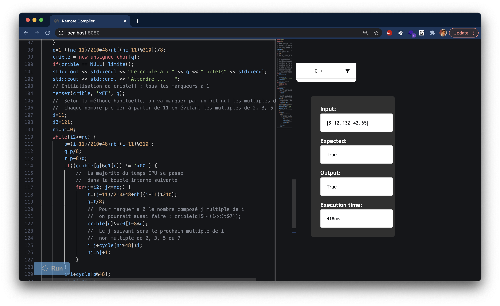

# remote-compiler
[in-dev] Compile code in different languages from a web or mobile app. Send input code to the API, then the server compiles it, executes it and returns you the output (error / success).

## Run the server
```javascript
node server.js
```

## Client demo
<p align="center">
  
</p>
